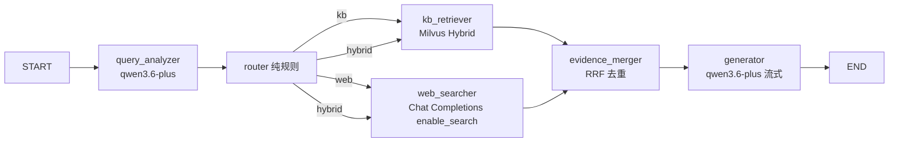
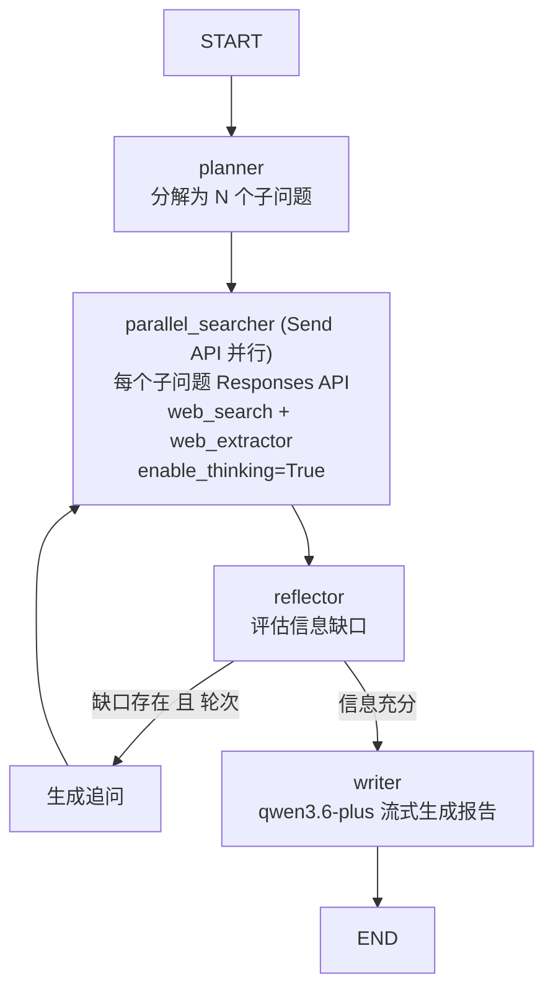
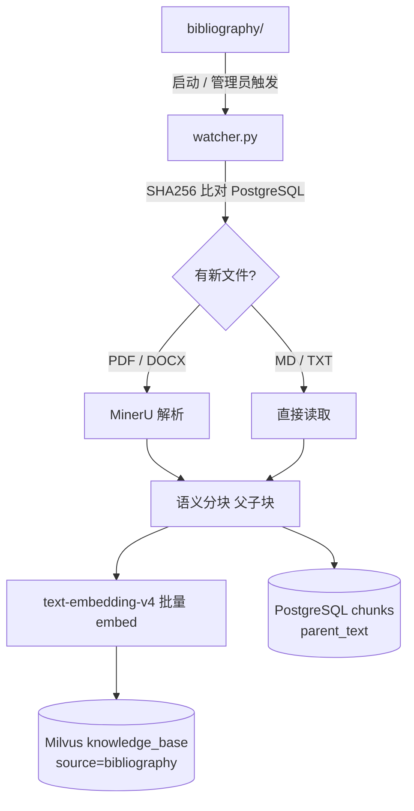

# RAG 智能体完整重构方案

## 最终技术栈

- **Agent 编排**：LangGraph（双模式：Pipeline RAG 快速问答 + Deep Research 深度研究）
- **文档解析**：MinerU（中文 OCR，PDF / MD / DOCX）
- **向量数据库**：Milvus Standalone（Docker，内置 BM25 + Dense，原生混合搜索）
- **关系数据库**：PostgreSQL 17（Docker，asyncpg + Alembic）
- **缓存**：Redis 7（Docker，LangGraph checkpointing + embedding 缓存 + 搜索结果缓存）
- **Embedding**：`text-embedding-v4`（DashScope API，dim=1024）
- **Rerank**：`qwen3-rerank`（DashScope API）
- **LLM / 联网搜索 / 文档智能**：`qwen3.6-plus`（DashScope，多种 API 组合）
  - 快速问答联网：Chat Completions `enable_search=True`, `strategy=agent_max`
  - Deep Research：Responses API `tools=[web_search, web_extractor]` 逐步调用
  - 文档智能：Files API `fileid://` 注入 system message
- **基础知识库**：`bibliography/` 文件夹（PDF、MD 等，自动增量摄入）
- **前端**：Next.js 16 + React 19 + Tailwind（重构结构，保留原 crimson/canvas 配色）

---

## 项目结构

```
RedShip/
├── legacy/                            # 旧代码完整归档（不删除）
├── bibliography/                      # 基础知识库文件夹（可持续添加）
│   ├── *.pdf / *.md / *.docx
├── backend/
│   ├── app/
│   │   ├── main.py
│   │   ├── core/
│   │   │   ├── config.py              # pydantic-settings
│   │   │   ├── security.py            # JWT
│   │   │   └── redis.py               # Redis 单例
│   │   ├── api/routes/
│   │   │   ├── auth.py
│   │   │   ├── chat.py                # SSE：快速问答 + 深度研究双模式
│   │   │   ├── knowledge.py           # 知识库 CRUD + 文件上传
│   │   │   ├── citations.py           # 引用预览详情
│   │   │   └── admin.py               # bibliography sync、reindex
│   │   ├── db/
│   │   │   ├── models.py
│   │   │   └── session.py             # AsyncSession
│   │   ├── agents/
│   │   │   ├── rag/                   # 快速问答 Pipeline RAG
│   │   │   │   ├── graph.py
│   │   │   │   ├── state.py
│   │   │   │   └── nodes.py
│   │   │   └── research/              # Deep Research 多轮研究图
│   │   │       ├── graph.py
│   │   │       ├── state.py
│   │   │       └── nodes.py
│   │   ├── knowledge/
│   │   │   ├── ingestion/
│   │   │   │   ├── parser.py          # MinerU（PDF/MD/DOCX）
│   │   │   │   ├── chunker.py         # 语义分块（父子块）
│   │   │   │   └── watcher.py         # bibliography/ 增量扫描
│   │   │   ├── indexer.py             # Milvus upsert
│   │   │   └── retriever.py           # Hybrid 检索 + rerank + 父块回溯
│   │   └── llm/
│   │       └── dashscope.py           # 统一客户端（embed / rerank / chat / responses / files）
│   ├── alembic/
│   ├── alembic.ini
│   ├── Dockerfile
│   └── requirements.txt
├── frontend/
│   ├── app/
│   │   ├── page.tsx                              # 主聊天界面
│   │   ├── knowledge/page.tsx                    # 知识库管理
│   │   ├── threads/[id]/citations/[cid]/page.tsx # 引用详情页
│   │   └── admin/page.tsx
│   ├── components/
│   │   ├── chat/
│   │   │   ├── ChatInterface.tsx                 # 模式切换（快速/深度研究）
│   │   │   ├── MessageList.tsx
│   │   │   ├── MarkdownMessage.tsx               # 内嵌引用 Chip 渲染
│   │   │   ├── ResearchProgress.tsx              # 深度研究进度面板
│   │   │   └── FileAttachment.tsx                # 会话文档上传
│   │   ├── citations/
│   │   │   ├── CitationChip.tsx                  # 复用旧组件
│   │   │   ├── CitationDetailView.tsx            # 复用旧组件
│   │   │   └── CitationPreviewProvider.tsx       # 复用旧组件
│   │   ├── knowledge/
│   │   │   ├── DocumentUploader.tsx
│   │   │   └── KnowledgeList.tsx
│   │   └── ui/                                   # shadcn/ui
│   ├── tailwind.config.js                        # 完整保留 crimson/canvas 配色
│   ├── app/globals.css                           # 完整保留 utility classes
│   ├── Dockerfile
│   └── lib/api.ts
├── docker-compose.yml                            # 7 个服务编排
├── docker-compose.override.yml                   # 开发模式热重载
└── .env.example                                  # 统一环境变量模板
```

---

## 核心架构设计

### 双模式聊天

前端聊天输入框提供模式切换，后端对应两套 LangGraph 图：

```
快速问答（Pipeline RAG）：响应 < 5 秒
  query_analyzer → router → [kb_retriever | web_searcher] → evidence_merger → generator

深度研究（Deep Research）：响应 1-10 分钟
  planner → parallel_searcher → reflector → [loop ≤ N轮] → writer
```

### Pipeline RAG 图（快速问答）




节点详情：

- `query_analyzer`：改写查询，抽取时间/人物/事件实体作为 Milvus scalar filter
- `web_searcher`：Chat Completions API，`enable_search=True, search_options.search_strategy=agent_max, enable_source=True`，响应自带 `search_info.search_results` 引用列表
- `kb_retriever`：Milvus Hybrid（ANN + BM25 RRFRanker）→ qwen3-rerank 精排 → 父块回溯
- `generator`：qwen3.6-plus 流式，System Prompt 要求在相关段落末尾插入 `[(N)](citations/cid)` 引用

### Deep Research 图

参考 `langchain-ai/open_deep_research`（GitHub 11k stars）的架构，使用 Responses API 逐步调用：




每个节点完成时通过 SSE 推送进度事件：

```
data: {"type": "research_step", "step": "planning",   "content": "分解为 4 个研究方向..."}
data: {"type": "research_step", "step": "searching",  "query": "中共一大会议背景", "sources": 5}
data: {"type": "research_step", "step": "extracting", "url": "...", "title": "..."}
data: {"type": "research_step", "step": "reflecting", "iteration": 2, "gap": "缺乏一手史料..."}
data: {"type": "research_step", "step": "writing"}
data: {"type": "token", "content": "# 研究报告\n..."}
data: {"type": "done",  "message_id": "m-1", "duration_seconds": 87, "sources_count": 14}
```

**Responses API 调用方式**（每次搜索迭代）：

```python
response = client.responses.create(
    model="qwen3.6-plus",
    input=sub_question,
    tools=[{"type": "web_search"}, {"type": "web_extractor"}],
    extra_body={"enable_thinking": True},
    stream=True,
)
# 流式接收 web_extractor_call 事件（goal + output）作为证据
```

### 文档智能（Files API）

聊天输入框附件按钮，文件上传后自动分档：

```
上传文件
  ├── ≤ 100k tokens（约 60 页 PDF）
  │     → DashScope Files API 上传 → fileid://
  │     → 注入 system message → 即时可用
  └── > 100k tokens（大文档）
        → MinerU 解析 → 分块 → embed → Milvus（source=session, thread_id=xxx）
        → 会话级 RAG，检索后回答
```

文件生命周期：绑定 thread，会话结束后 DashScope 文件可选删除，Milvus session 向量定期清理。

### DashScope 统一客户端（`llm/dashscope.py`）

```python
# 五种调用，统一封装，同一 DASHSCOPE_API_KEY

embed(texts) -> list[list[float]]                # text-embedding-v4, dim=1024
rerank(query, docs, top_n) -> list[RerankResult] # qwen3-rerank
chat_stream(messages, enable_search=False, ...)  # Chat Completions 流式
responses_stream(input, tools, ...)              # Responses API 流式（Deep Research 用）
upload_file(path) -> file_id                     # Files API
```

### Milvus Collection 设计（中文 jieba 分词）

```python
schema.add_field("id",        DataType.VARCHAR, is_primary=True)
schema.add_field("text",      DataType.VARCHAR,
                 enable_analyzer=True,
                 analyzer_params={"tokenizer": "jieba"})    # 中文分词
schema.add_field("sparse",    DataType.SPARSE_FLOAT_VECTOR) # BM25 自动生成
schema.add_field("dense",     DataType.FLOAT_VECTOR, dim=1024)
schema.add_field("source",    DataType.VARCHAR)   # bibliography | upload | session
schema.add_field("doc_id",    DataType.VARCHAR)
schema.add_field("chunk_type", DataType.VARCHAR)  # child | parent
schema.add_field("era",       DataType.VARCHAR)   # 历史时期 filter
schema.add_function(Function("bm25", text_field="text", output_field="sparse"))
```

**两阶段检索**：

1. `AnnSearchRequest`(dense) + `AnnSearchRequest`(sparse BM25) → `RRFRanker` 融合 top-20 子块
2. qwen3-rerank API 精排 → top-5 子块
3. PostgreSQL 回溯父块（512 tokens 完整上下文）
4. 送入 qwen3.6-plus 生成

### bibliography/ 增量摄入管道




可拓展性：向 `bibliography/` 添加新文件后调用 `POST /api/admin/bibliography/sync` 即可增量摄入，不影响已有索引。

### Redis 用途


| 用途                   | Key 格式                   | TTL   |
| -------------------- | ------------------------ | ----- |
| LangGraph checkpoint | `ckpt:{thread_id}`       | 7 天   |
| Query embedding      | `emb:{sha256(query)}`    | 1 小时  |
| 联网搜索结果               | `search:{sha256(query)}` | 24 小时 |


### 数据库模型（精简版）

- `User`：认证用户
- `Document`：文档元数据（来源、状态、文件路径、SHA256）
- `KnowledgeChunk`：分块记录（doc_id、chunk_index、milvus_id、parent_text）
- `Thread`：对话线程（mode = chat | research）
- `Message`：对话消息（content_markdown 含引用链接、citations JSON）
- `SessionFile`：会话级上传文件（thread_id、file_id 或 milvus session_collection）
- `AuditLog`：操作审计

### Docker Compose（7 个服务）

```
服务          镜像                       端口        依赖
─────────────────────────────────────────────────────────────
backend       ./backend Dockerfile       8005        postgres, redis, milvus
frontend      ./frontend Dockerfile      8006        backend
postgres      postgres:17-alpine         5432        -
redis         redis:7-alpine             6379        -
milvus        milvusdb/milvus:v2.5       19530/9091  etcd, minio
etcd          bitnami/etcd:3             2379        -
minio         minio/minio                9000/9001   -
```

**Dockerfile 策略**：

- `backend/Dockerfile`：Python 3.12-slim，multi-stage。**无 torch / transformers**，镜像体积大幅缩减，仅需 MinerU OCR 依赖。
- `frontend/Dockerfile`：Node 20-alpine，multi-stage（deps → builder `next build` → runner `standalone`）。

**数据持久化**（named volumes）：`postgres_data`、`redis_data`、`milvus_data`、`etcd_data`、`minio_data`

**开发热重载**（`docker-compose.override.yml`）：

- backend：挂载 `./backend/app`，启动命令加 `--reload`
- frontend：挂载 `./frontend`，`npm run dev` 替换 `node server.js`

**统一环境变量**（根目录 `.env`，通过 `env_file: .env` 注入）：

```
DASHSCOPE_API_KEY=...              # 覆盖全部 AI 调用
EMBEDDING_MODEL=text-embedding-v4
RERANK_MODEL=qwen3-rerank
CHAT_MODEL=qwen3.6-plus
RESEARCH_MAX_ITERATIONS=6
RESEARCH_PARALLEL_SUBQUERIES=4
```

### 内嵌引用机制（复用旧前端逻辑）

**后端 generator / writer 输出**（含引用链接的 Markdown）：

```markdown
1921年7月，中共一大在上海召开[(1)](/threads/t-1/messages/m-1/citations/c-1)，
标志着中国共产党正式成立[(2)](/threads/t-1/messages/m-1/citations/c-2)。
```

**前端 `MarkdownMessage.tsx`**（等效旧 `MarkdownReport.tsx`）：

- ReactMarkdown 自定义 `a` 渲染器匹配 `/threads/.../citations/...`
- 标签符合正则 `/^\s*(?:\(\d+\)|#\d+|\[\d+\])\s*/` 则渲染为 `CitationChip variant="report-inline"`（zinc 小 pill）
- 悬停触发 `CitationPreviewProvider` 浮动预览卡片

**SSE 流式事件**（generator 流式输出时先推送引用元数据）：

```
data: {"type": "citations_ready", "items": [{id, title, source_type, url, excerpt, highlight_text}]}
data: {"type": "token", "content": "1921年7月，中共一大..."}
data: {"type": "token", "content": "在上海召开[(1)](/threads/.../citations/c-1)"}
data: {"type": "done", "message_id": "m-1"}
```

### 前端配色保留策略

**完全照搬**以下两个文件到新前端，零修改：

- `tailwind.config.js`：`canvas` (#F8F3EF)、`card` (#FFFDFB)、`crimson-{50..900}`、`shadow-soft`、`fontFamily.sans`
- `app/globals.css`：背景渐变（`radial-gradient(circle at 10% 10%, #fbe7e2, #f8f3ef 45%, #f3ece6 100%)`）、`.panel`、`.btn-primary`、`.btn-outline`、`.input`、`.label`、`.report-markdown`、`.report-link` 等所有 utility class

**直接文件迁移**的旧组件：

- `components/citations/CitationChip.tsx`（两种 variant）
- `components/citations/CitationDetailView.tsx`
- `components/citations/CitationPreviewProvider.tsx`（悬停预览）

**新建**组件基于 shadcn/ui + 现有配色体系：

- `MarkdownMessage.tsx`：等效旧 `MarkdownReport.tsx`
- `ChatInterface.tsx`、`ResearchProgress.tsx`、`FileAttachment.tsx`、`DocumentUploader.tsx`、`KnowledgeList.tsx`

---

## 实施阶段

1. **归档 + 脚手架**：`legacy/` 归档旧代码，新目录结构（含 `bibliography/`），`docker-compose.yml`（全 7 服务），各服务 Dockerfile，`.env.example`，Alembic 初始化
2. **核心基础层**：PostgreSQL models + Alembic migrations，Redis 单例，JWT auth
3. **DashScope 统一客户端**：`dashscope.py` 封装 5 类调用（embed / rerank / chat_stream / responses_stream / upload_file）
4. **知识库摄入**：MinerU 集成（PDF/MD/DOCX），语义分块（父子块），Milvus Collection schema（jieba BM25 + dense），`watcher.py` 增量扫描 `bibliography/`
5. **检索层**：Hybrid 搜索（ANN + BM25 + RRFRanker）→ qwen3-rerank API 精排 → 父块回溯，Redis embedding 缓存
6. **Pipeline RAG 图**：LangGraph StateGraph，内嵌引用 Markdown 生成，SSE 流式输出
7. **Deep Research 图**：LangGraph 多步研究图，Responses API 迭代搜索 + 反思循环，SSE 进度事件，报告生成
8. **文档智能**：Files API 小文档注入 + 大文档 session RAG，聊天附件 UI
9. **API 层**：auth、chat SSE（双模式）、knowledge CRUD + 上传、session 文档、citations 预览、admin/bibliography sync
10. **前端重构**：迁移配色与引用组件，新建 `ChatInterface`（模式切换）、`ResearchProgress`、`MarkdownMessage`、`FileAttachment`、`KnowledgeList`，API 对接

