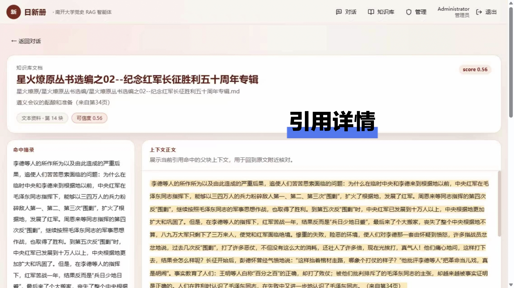
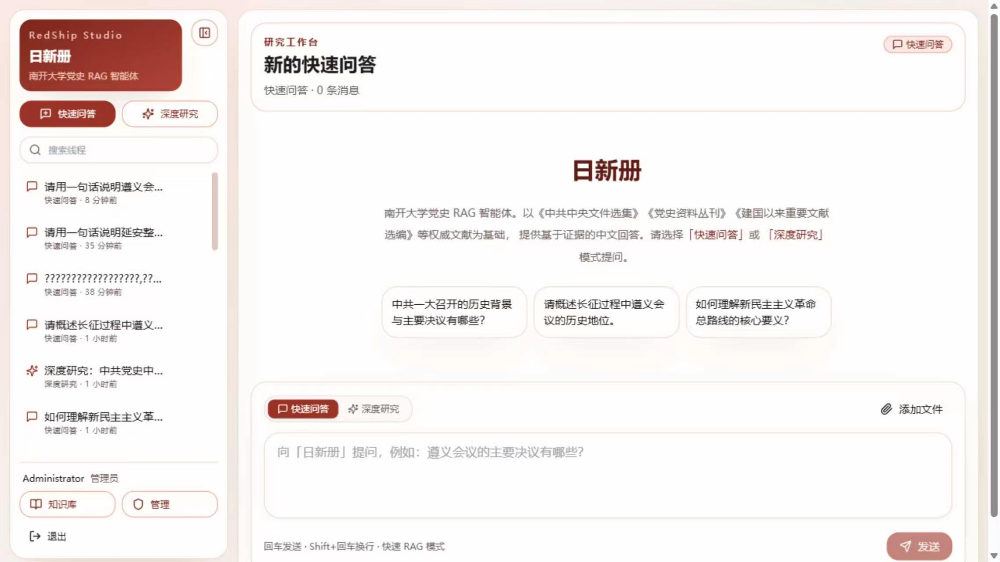
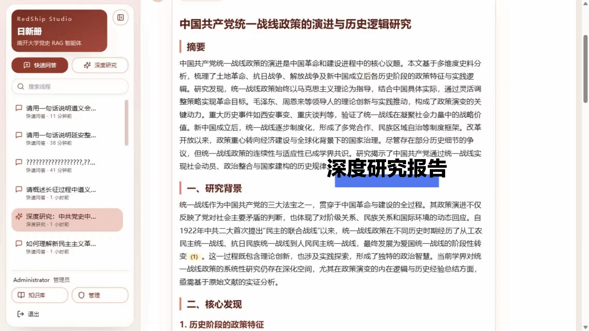
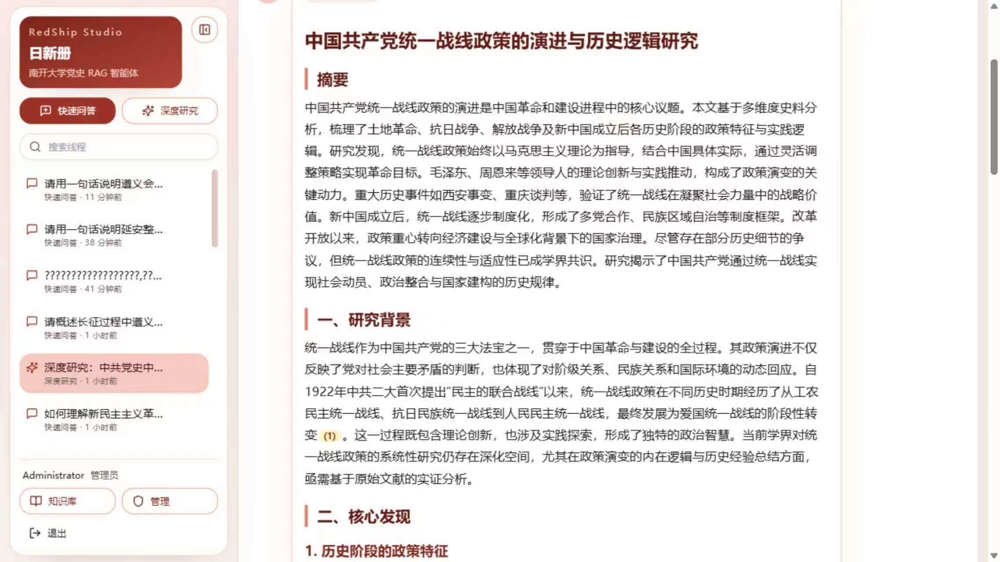
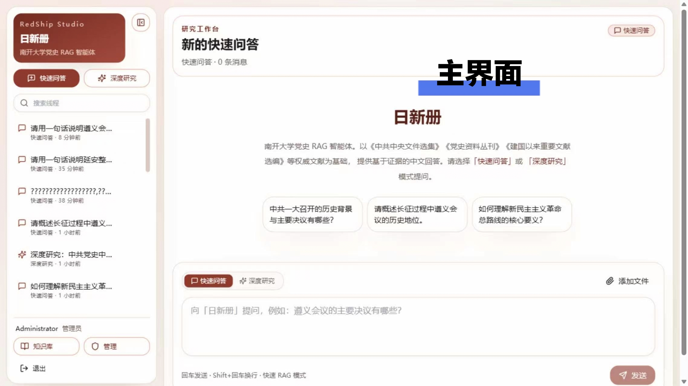

# 日新册 · RedShip

南开大学党史 RAG 智能体 —— 支持**快速问答**与**深度研究**双模式，全部能力通过 DashScope API 调用（无本地大模型），Docker Compose 一键部署。

## 功能概览

| 模式 | 说明 | 典型耗时 |
|------|------|----------|
| 快速问答 | Pipeline RAG：知识库混合检索 + 可选联网搜索 | &lt; 5 秒 |
| 深度研究 | 规划 → 并行联网检索/抽取 → 反思循环 → 报告生成 | 1–10 分钟 |

- **知识库**：`bibliography/` 目录增量摄入（SHA-256），Milvus `knowledge_base` 混合检索 → qwen3-rerank 精排
- **会话附件 / 文档智能**：上传后异步解析；小文档 **全文注入**（本地抽取正文进 system）并写入 `session_chunks`；大文档/图片走会话 RAG；扫描 PDF 在 MinerU 过短时可回退 Vision PDF。默认 `qwen3.5-flash` **不依赖** `fileid://`（仅 `qwen-long` / `qwen-doc*` 等才注入）。面板支持处理状态、重试与预览。
- **记忆**：会话滚动摘要 + 滑动窗口；用户长期记忆跨会话召回（`/api/me/memories`）
- **引用**：答案段落内嵌 `[(N)](/threads/.../citations/...)`，悬停预览

## 快速开始

### 1. 配置环境

```bash
cp .env.example .env
# 编辑 .env：填入 DASHSCOPE_API_KEY，并设置强随机 JWT_SECRET / 管理员密码
```

`.env` **不要提交到 Git**。本地凭据快照可放在已忽略的 `.local/secrets-backup/`（仓库内已提供该约定）。后端默认拒绝占位密钥；仅本地排障时可设 `ALLOW_INSECURE_DEFAULTS=true`。

### 2. 启动服务（7 个容器）

```bash
docker compose up -d --build
```

| 服务 | 端口 | 说明 |
|------|------|------|
| frontend | 8006 | Next.js 前端 |
| backend | 8005 | FastAPI 后端 |
| postgres | 5432 | 元数据 |
| redis | 6379 | 缓存 |
| milvus | 19530 | 向量库 |
| etcd / minio | — | Milvus 依赖 |

开发热重载：使用 `docker compose up`（会自动加载 `docker-compose.override.yml`）。详见下文 [Docker Compose 说明](#docker-compose-说明)。

### 3. 访问

- 前端：http://localhost:8006
- API 文档：http://localhost:8005/docs
- 管理员账号：见本地 `.env` 中的 `ADMIN_BOOTSTRAP_EMAIL` / `ADMIN_BOOTSTRAP_PASSWORD`（勿使用示例弱口令）

### 4. 导入文献

将 PDF / MD / DOCX 放入 `bibliography/`，然后：

- 管理页点击「增量同步」，或
- `POST /api/admin/bibliography/sync`

## 项目结构

```
RedShip/
├── bibliography/          # 可扩展知识库（挂载进容器）
├── raw/                   # MinerU 输入（PDF/DOCX，仅 mineru compose 使用）
├── export/                # export-data.sh 默认输出目录
├── scripts/               # 数据迁移 + 全量部署导出/导入
├── backend/               # FastAPI + LangGraph
├── frontend/              # Next.js + Tailwind（crimson/canvas 配色）
├── legacy/                # 归档说明
├── docker-compose.yml           # 全栈 App
├── docker-compose.override.yml  # 开发热重载（自动合并）
├── docker-compose.data.yml      # 数据层建库（MD-only）
├── docker-compose.mineru.yml    # MinerU 批转换
├── CHAT.md / RESPONSE.md / EMBEDDING.md / RERANK.md
└── .env.example
```

## 文档智能（会话附件）

```
上传 → status=processing（立即返回）
  → 抽取正文（txt/md/docx；PDF=MinerU，过短且 VISION_PDF_ENABLED → Vision PDF；图片=VL）
  → 分块 embed → Milvus session_chunks（所有就绪附件均可检索）
  → 文本量 ≤ 阈值 → mode=fulltext：缓存 extracted_text，对话时注入 system
                    （可选备份上传 DashScope Files；仅 FILEID_CAPABLE_MODELS 才注入 fileid://）
  → 否则 → mode=session_rag：仅检索命中段落
失败 → status=failed（可重试）；面板可预览 PDF/文本/图片
```

相关 API：`POST/GET /api/threads/{id}/files`、`POST .../files/{fid}/retry`、`GET .../content`、`GET .../text`。

关键变量：`SESSION_INLINE_MAX_CHARS`、`FILEID_CAPABLE_MODELS`、`VISION_PDF_ENABLED`、`FILES_API_INLINE_MAX_*`。

## 环境变量（核心）

```env
DASHSCOPE_API_KEY=sk-...
CHAT_MODEL=qwen3.5-flash
RESEARCH_MODEL=qwen3.5-plus
EMBEDDING_MODEL=text-embedding-v4
RERANK_MODEL=qwen3-rerank
RESEARCH_MAX_ITERATIONS=6
```

完整列表见 [`.env.example`](.env.example)。

## API 要点

| 路由 | 说明 |
|------|------|
| `POST /api/auth/login` | JWT 登录 |
| `POST /api/chat/stream` | SSE 双模式聊天 |
| `GET /api/knowledge/documents` | 知识库列表 |
| `GET /api/knowledge/documents/{id}/source` | 探测 MD 对应源 PDF（`available`）；`/source/file` 或 `/pdf` 下载 |
| `POST /api/knowledge/documents/upload` | 管理员上传文档 |
| `POST /api/admin/bibliography/sync` | 增量同步 |
| `POST /api/admin/bibliography/reindex` | 全量重建索引 |
| `POST /api/threads/{id}/files` | 会话附件上传（异步，立即 `processing`） |
| `POST /api/threads/{id}/files/{fid}/retry` | 失败附件重试 |
| `GET /api/threads/{id}/files/{fid}/content` | 附件原文件流（预览） |
| `GET /api/threads/{id}/files/{fid}/text` | 抽取正文（预览） |

## Docker Compose 说明

项目提供多份 Compose 文件，按场景选用；**默认日常开发/部署只用** [`docker-compose.yml`](docker-compose.yml)。

| 文件 | 用途 | 典型命令 |
|------|------|----------|
| [`docker-compose.yml`](docker-compose.yml) | **全栈 App**：PG + Milvus + Redis + backend + frontend | `docker compose up -d --build` |
| [`docker-compose.override.yml`](docker-compose.override.yml) | **开发热重载**（自动合并）：backend `--reload`、frontend `npm run dev`、源码 bind-mount | 与主 compose 同目录执行 `docker compose up` 即生效 |
| [`docker-compose.data.yml`](docker-compose.data.yml) | **数据层建库**：PG + Milvus + Redis + backend（无 frontend、无 MinerU）；文献仅成品 `.md` | `docker compose -f docker-compose.data.yml up -d --build` |
| [`docker-compose.mineru.yml`](docker-compose.mineru.yml) | **仅 MinerU 批转换**：PDF/DOCX → Markdown，不跑 App | `docker compose -f docker-compose.mineru.yml run --rm mineru` |

### 全栈（docker-compose.yml）

7 个服务一次启动，`.env` 中 `POSTGRES_HOST=postgres`、`MILVUS_HOST=milvus` 等保持默认即可。

```bash
docker compose up -d --build          # 生产式镜像
docker compose up                     # 有 override 时 backend/frontend 为热重载开发模式
docker compose up -d redis backend frontend   # 若已从别处导入 PG/Milvus volume，可只起应用层
```

### 开发热重载（docker-compose.override.yml）

存在 [`docker-compose.override.yml`](docker-compose.override.yml) 时，Docker Compose **自动合并**配置，无需 `-f`：

- **backend**：`uvicorn --reload`，挂载 `./backend/app`
- **frontend**：`npm run dev`，挂载 `./frontend/app` 等

改 Python/TS 源码后保存即生效；改 `requirements.txt`、`Dockerfile` 或 `.env` 通常需重建/重启容器。

显式禁用 override、只用生产式启动：

```bash
docker compose -f docker-compose.yml up -d --build
```

### 数据层建库（docker-compose.data.yml）

在 **A 机**用成品 Markdown 做完 embedding，再拷到 **B 机**跑全栈 App（见 [数据迁移脚本](#数据迁移脚本)）。

- 使用 [`backend/Dockerfile.data`](backend/Dockerfile.data)（**不含 MinerU**）
- 环境变量 `BIBLIOGRAPHY_MARKDOWN_ONLY=true`，只扫描 `bibliography/` 下 `.md` / `.markdown`
- 含：postgres、redis、milvus（etcd/minio）、backend；**不含** frontend

```bash
cp .env.example .env   # 必填 DASHSCOPE_API_KEY
# 成品 MD 放入 ./bibliography/

docker compose -f docker-compose.data.yml up -d --build
docker compose -f docker-compose.data.yml exec backend alembic upgrade head   # 空库时
# 全量索引：管理页或 POST /api/admin/bibliography/reindex

./scripts/export-data.sh -f docker-compose.data.yml   # 导出 volume 包
```

### MinerU 批转换（docker-compose.mineru.yml）

将 PDF/DOCX 转为 Markdown，输出到 `bibliography/`，供 data compose 或主 compose 索引。

```bash
mkdir -p raw bibliography
# PDF/DOCX 放入 ./raw/（可含子目录）

docker compose -f docker-compose.mineru.yml run --rm mineru
# 输出：./bibliography/ 下与 raw 同路径的 .md 文件
```

批处理逻辑见 [`backend/scripts/mineru_batch.sh`](backend/scripts/mineru_batch.sh)。文献若已是 Markdown，**可跳过此步骤**。

### 推荐离线流水线（A 机建库 → B 机开发）

```text
[可选] mineru compose     raw/ → bibliography/*.md
         ↓
        data compose       MD → PG + Milvus + Redis（embedding）
         ↓
        export-data.sh     打包 volume + bibliography
         ↓
        import-data.sh     B 机还原
         ↓
        docker compose up -d   全栈 App
```

## 数据迁移脚本

脚本位于 [`scripts/`](scripts/)，在 **项目根目录**用 **WSL 或 Git Bash** 执行（Windows 原生 PowerShell 不能直接跑 bash）。

| 脚本 | 作用 |
|------|------|
| [`scripts/export-data.sh`](scripts/export-data.sh) | 停服 → 打包 Docker volume + `bibliography/` → 生成 `manifest.json` |
| [`scripts/import-data.sh`](scripts/import-data.sh) | 按 manifest 还原 volume 与文献目录 |
| [`scripts/export-deploy.sh`](scripts/export-deploy.sh) / [`.ps1`](scripts/export-deploy.ps1) | 全量部署包：生产镜像 + compose + 可选数据 |
| [`scripts/import-deploy.sh`](scripts/import-deploy.sh) | 服务器端加载镜像、可选还原数据、compose up |
| [`scripts/lib/data-transfer.sh`](scripts/lib/data-transfer.sh) | 公共库（一般无需直接调用） |

### 备份内容

| 组件 | 说明 |
|------|------|
| `postgres_data` | 用户、对话、文献元数据 |
| `milvus_data` + `etcd_data` + `minio_data` | 向量索引（三者须同包拷贝） |
| `redis_data` | embedding 缓存、联网搜索缓存、LangGraph checkpoint |
| `backend_uploads` | 会话上传附件（主 compose 才有） |
| `bibliography/` | 文献源文件（bind mount，单独打 tar） |
| `postgres.pg.dump` | 可选 sidecar，便于人工检查 |

**不备份**：`.env`、DashScope Files API 远端 `fileid`（可选备份；跨机后若依赖 fileid 需重新上传，本地全文/RAG 不受影响）。

### 导出

```bash
./scripts/export-data.sh
# 默认：docker-compose.yml → ./export/redship-YYYYMMDD-HHMMSS/

./scripts/export-data.sh -f docker-compose.data.yml
./scripts/export-data.sh -o /path/to/backup
./scripts/export-data.sh --skip-bibliography    # 仅 volume（文献另拷）
./scripts/export-data.sh --skip-redis           # 排除 Redis（不推荐，默认含 Redis）
./scripts/export-data.sh --skip-uploads         # 排除会话上传 volume
./scripts/export-data.sh --no-pg-dump           # 不要 postgres.pg.dump
```

导出会 **停止** 对应 compose 的全部服务，结束后需自行 `docker compose up -d`。

### 导入

```bash
./scripts/import-data.sh ./export/redship-20260522-120000/
./scripts/import-data.sh ./export/redship-... -f docker-compose.yml
./scripts/import-data.sh ./export/redship-... --force    # 覆盖非空 volume / bibliography
./scripts/import-data.sh ./export/redship-... --verify   # 校验 manifest 中的 sha256
```

导入完成后：

```bash
docker compose up -d
```

**勿**在完整还原后再跑 `alembic upgrade head` 或全量 `reindex`（volume 里已有 schema 与向量）。仅当只拷了 PG、未拷 Milvus 三件套时，才需要在 B 机对 `bibliography/` 做 reindex。

跨 compose 迁移示例：A 机 `-f docker-compose.data.yml` 导出，B 机 `-f docker-compose.yml` 导入（按 volume 逻辑名匹配，project 前缀可以不同）。

### 全量部署导出（服务器端）

把**生产镜像** + compose 骨架打成可离线部署的包（只用 `docker-compose.yml`，**不含** `docker-compose.override.yml` / `.env` 密钥 / `node_modules`）。

```bash
# Git Bash / WSL（推荐）
./scripts/export-deploy.sh                  # 构建并 docker save → ./export/redship-deploy-*/
./scripts/export-deploy.sh --with-data      # 同上，并附带 volume/bibliography（调用 export-data.sh）
./scripts/export-deploy.sh --skip-build     # 不重建，用本地已有镜像
./scripts/export-deploy.sh --no-final-tar   # 只要目录，不要外层 .tar.gz

# Windows PowerShell
.\scripts\export-deploy.ps1
.\scripts\export-deploy.ps1 -WithData
```

包内容大致为：

```
export/redship-deploy-YYYYMMDD-HHMMSS/
├── deploy-manifest.json
└── deploy/
    ├── docker-compose.yml      # backend/frontend 已钉死为 image:（无需现场 build）
    ├── .env.example
    ├── bibliography/
    ├── images/redship-images.tar.gz
    ├── backend/Dockerfile      # 仅备查；有镜像时不需要
    ├── frontend/Dockerfile
    └── scripts/import-deploy.sh + import-data.sh …
```

目标服务器：

```bash
tar xzf redship-deploy-….tar.gz
cd redship-deploy-…/deploy
./scripts/import-deploy.sh .                 # load 镜像 → .env → 可选 data → up -d
# ./scripts/import-deploy.sh . --force-data  # 覆盖已有 volume
# ./scripts/import-deploy.sh . --skip-up     # 只加载，不启动
```

编辑 `.env`（`DASHSCOPE_API_KEY`、`JWT_SECRET` 等）后再对外服务。公网同源部署保持 `NEXT_PUBLIC_API_BASE_URL` 为空。

## 技术栈

- **编排**：LangGraph StateGraph（Pipeline RAG + Deep Research），Redis checkpoint（`ckpt:{thread_id}`，7 天 TTL）
- **解析**：PDF/DOCX 仅 MinerU（`pipeline` CPU 后端）；MD/TXT 直接读取
- **向量库**：Milvus 2.5（Hybrid + RRFRanker）
- **关系库**：PostgreSQL 17 + Alembic
- **缓存**：Redis（LangGraph checkpoint、embedding 缓存、联网搜索缓存）
- **AI**：官方 `dashscope` SDK（Generation / Embedding / TextReRank / 多模态）；Responses 与 Files(file-extract) 仍走 compatible-mode HTTP
- **记忆**：会话摘要存 `Thread.extra_metadata`；用户记忆表 `user_memories` + Milvus `user_memory`
- **语料隔离**：管理员 `knowledge_base` vs 会话 `session_chunks` vs 用户记忆 `user_memory`

## 测试

仓库提供三层测试：单元（无服务）、集成（本机 Postgres `redship_test` + mock LLM/Milvus）、系统（已启动的 Docker Compose）。

### 后端（pytest）

```bash
cd backend
pip install -r requirements-dev.txt

# 单元：不依赖 Docker
pytest -m unit

# 集成：需本机可连 Postgres（例如只起 compose 的 postgres，端口 5432）
# 首次会自动创建库 redship_test
pytest -m integration

# 系统：需完整 compose，backend 监听 :8005
pytest -m system
```

环境变量（可选）：`TEST_POSTGRES_HOST`（默认 `localhost`）、`E2E_ADMIN_EMAIL` / `E2E_ADMIN_PASSWORD`（默认读 `.env` 的 bootstrap）、`SYSTEM_API_BASE`（默认 `http://localhost:8005`）。

### 前端（Vitest + Playwright）

```bash
cd frontend
npm install

# 单元 / 组件
npm test

# 系统 E2E：需 frontend :8006（及后端）已由 compose 启动
npx playwright install chromium
npm run test:e2e
```

凭证同样使用 `E2E_ADMIN_*` 或根目录 `.env` 中的 `ADMIN_BOOTSTRAP_*`。Compose 未启动时系统测试会自动 skip。

## 界面预览








